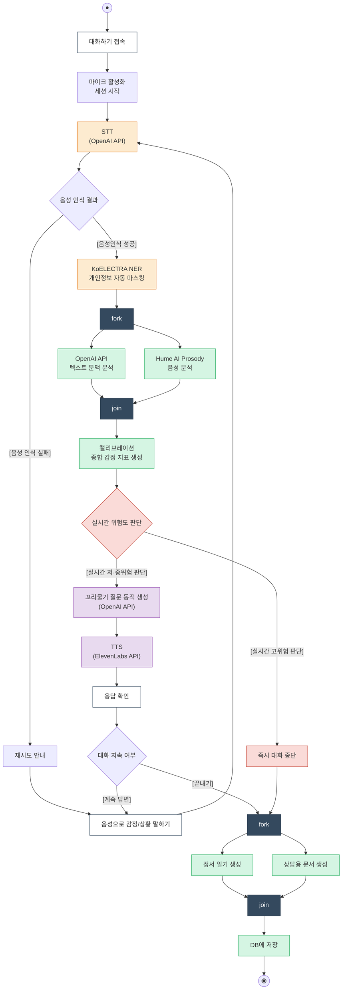
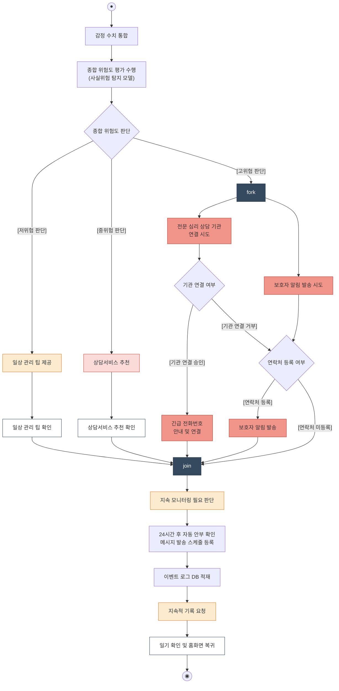
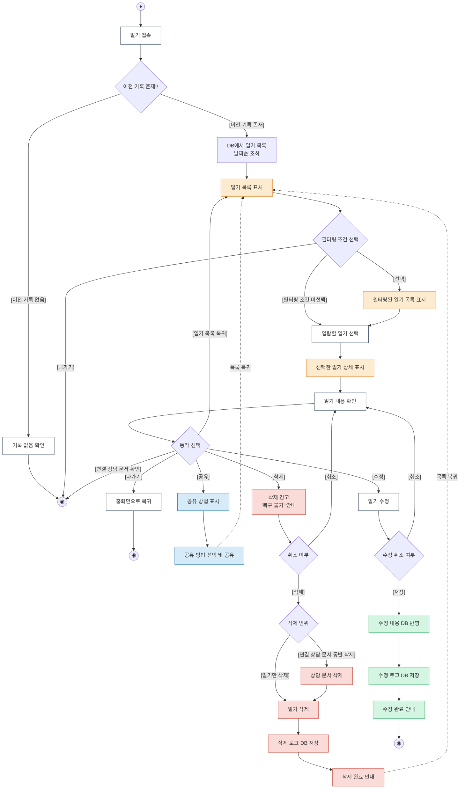
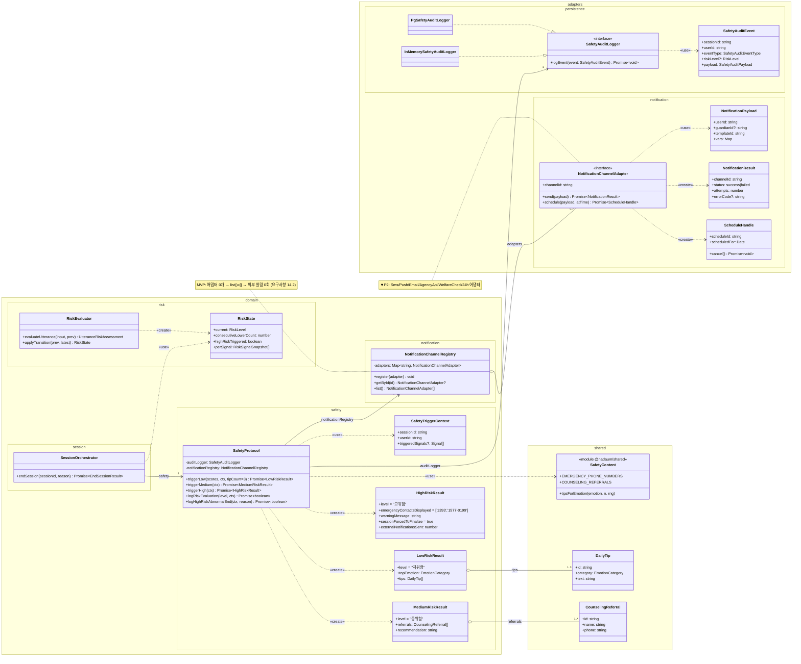
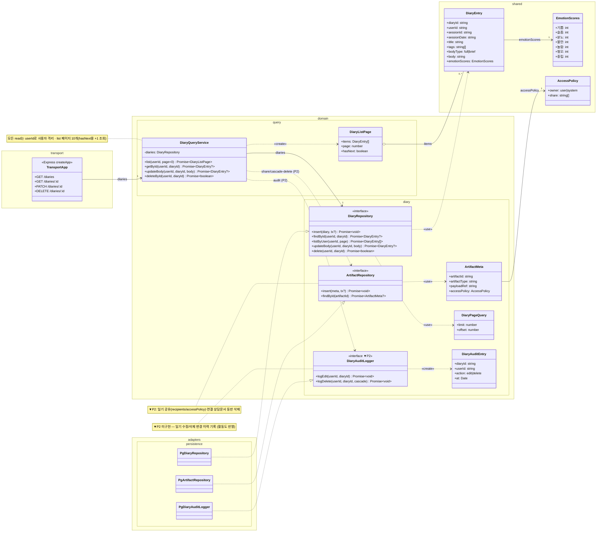
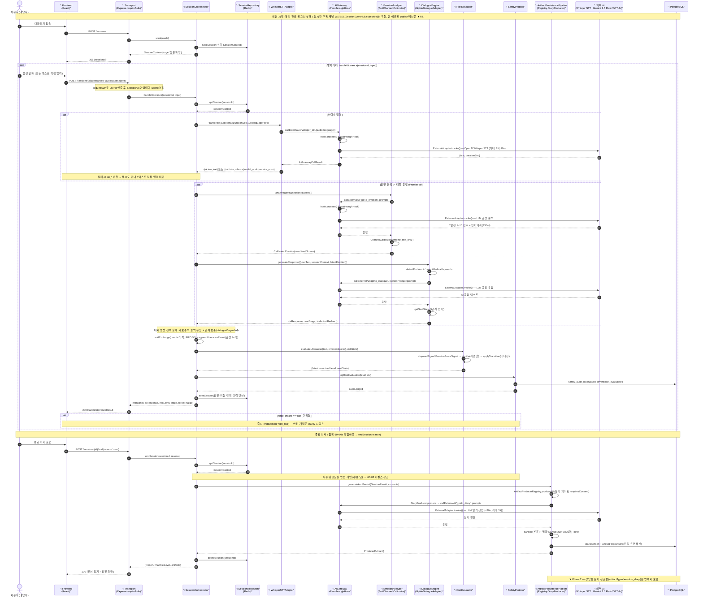
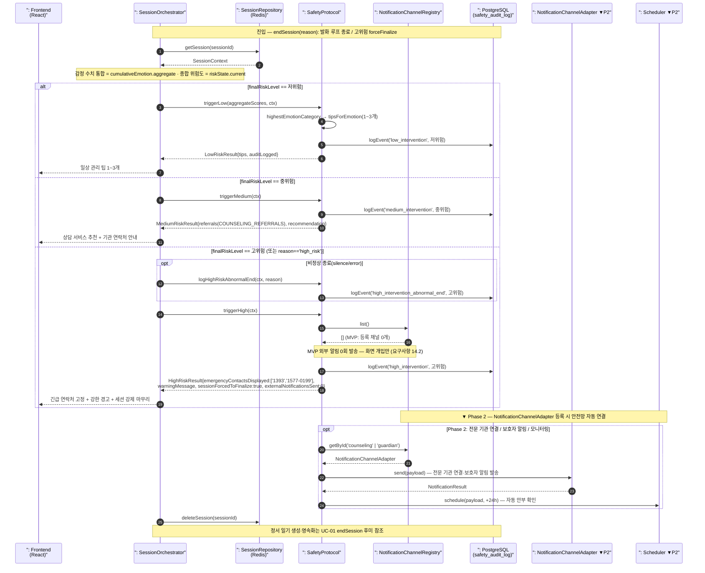
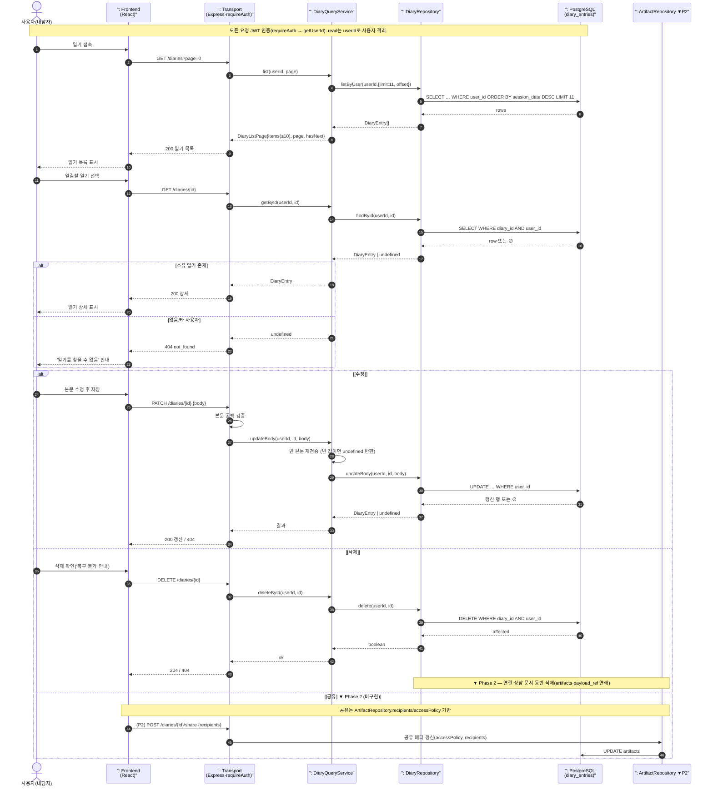

# 「나,다움」 UML 다이어그램

> 설계 문서(design.md) 기반 UML 5종 다이어그램
> 유스케이스 다이어그램 → 유스케이스 명세서 → 액티비티 다이어그램 → 클래스 다이어그램 → 시퀀스 다이어그램

---

## 1. 유스케이스 다이어그램 (Use Case Diagram)

### 시스템 경계: 「나,다움」 플랫폼 (System Architecture)

```mermaid
graph LR
    %% ===== Actors =====
    내담자(("👤<br/>내담자<br/>(사용자)"))
    보호자(("👤<br/>보호자<br/>(Secondary)"))
    상담사(("👤<br/>심리 상담사<br/>(Secondary)"))

    subgraph SYS["System Architecture"]
        direction TB

        %% ----- 대화 세션 -----
        subgraph 대화["대화 세션"]
            UC01(("UC-01<br/>대화 기반 내면 탐색<br/>(AI 통화)"))
            STT((STT 변환))
            MASK((개인정보 마스킹))
            MULTI((실시간 멀티모달<br/>심리 상태 분석))
            CRISIS((실시간 위기<br/>상황 감지))
            FOLLOW((꼬리물기 질문 생성))
            TTS((TTS 변환))
            REC((대화 기록 생성))
            DIARY((일기 생성))
            DOC((상담용 문서 생성))
        end

        %% ----- 사용자 인증 세션 -----
        subgraph 인증["사용자 인증 세션"]
            SIGNUP((회원 가입))
            LOGIN((로그인))
            GUARD((보호자 등록))
            ADDR((주소지 등록))
            CONSENT((개인정보 수집 동의<br/>및 비의료 서비스 안내))
        end

        %% ----- 포스트프로세스 세션 -----
        subgraph POST["포스트프로세스(종합 평가 및 안전망) 세션"]
            UCC2(("UC-C2<br/>종합 위험도 평가<br/>및 안전망 연결"))
            TIP((일상 팁 제공))
            REFER((상담 서비스 추천))
            ALARM((안부 및 재대화 알림))
            CONNECT((상담 연결))
            GCONNECT((보호자 연결))
        end

        %% ----- 기록 관리 세션 -----
        subgraph 기록["기록 관리 세션"]
            UCC3(("UC-C3<br/>대화 기록 관리"))
            DMANAGE((일기 관리))
            DVIEW((일기 조회))
            DEDIT((일기 수정))
            DDEL((일기 삭제))
            DSHARE((일기 공유))
            DOCMNG((문서 관리))
            DOCVIEW((문서 조회))
            DOCSHARE((문서 공유))
        end
    end

    %% ===== Actor associations =====
    내담자 --- UC01
    내담자 --- REC
    내담자 --- LOGIN
    내담자 --- UCC3
    보호자 --- GCONNECT
    상담사 --- DOCMNG

    %% ===== 대화 세션 includes =====
    UC01 -.->|initiate| STT
    UC01 -.->|include| MASK
    UC01 -.->|include| MULTI
    UC01 -.->|include| CRISIS
    UC01 -.->|include| FOLLOW
    UC01 -.->|include| TTS
    REC -.->|include| DIARY
    REC -.->|include| DOC

    %% ===== 인증 세션 =====
    LOGIN -.->|include| SIGNUP
    LOGIN -.->|"extend [최초 로그인]"| GUARD
    LOGIN -.->|"extend [최초 가입]"| ADDR
    LOGIN -.->|"extend [최초 로그인]"| CONSENT

    %% ===== 포스트프로세스: extend → UC-C2 =====
    TIP -.->|"extend [저위험]"| UCC2
    REFER -.->|"extend [중위험]"| UCC2
    ALARM -.->|"extend [중위험]"| UCC2
    CONNECT -.->|"extend [고위험]"| UCC2
    GCONNECT -.->|"extend [고위험]"| UCC2

    %% ===== 기록 관리 세션 =====
    UCC3 --> DMANAGE
    UCC3 --> DOCMNG
    DMANAGE --> DVIEW
    DMANAGE --> DEDIT
    DMANAGE --> DDEL
    DMANAGE --> DSHARE
    DOCMNG --> DOCVIEW
    DOCMNG --> DOCSHARE

    classDef talk fill:#d5f5e3,stroke:#27ae60;
    classDef auth fill:#eaecee,stroke:#7f8c8d;
    classDef post fill:#fdebd0,stroke:#e67e22;
    classDef rec fill:#d6eaf8,stroke:#2980b9;
    class UC01,STT,MASK,MULTI,CRISIS,FOLLOW,TTS,REC,DIARY,DOC talk;
    class SIGNUP,LOGIN,GUARD,ADDR,CONSENT auth;
    class UCC2,TIP,REFER,ALARM,CONNECT,GCONNECT post;
    class UCC3,DMANAGE,DVIEW,DEDIT,DDEL,DSHARE,DOCMNG,DOCVIEW,DOCSHARE rec;
```



### 액터 정의

| 액터 | 역할 | 유형 |
|------|------|------|
| 내담자(사용자) | 음성 대화로 감정을 탐색·기록하고 일기/문서를 관리하는 주 사용자 (10~30대) | Primary |
| 보호자 | 고위험 상황에서 알림을 받고 연결되는 보호 대상 연락처 | Secondary |
| 심리 상담사 | 상담용 문서를 열람·공유받는 외부 전문 인력 | Secondary |

### 세션(패키지) 구성

| 세션 | 핵심 유스케이스 | 색상 |
|------|----------------|------|
| 대화 세션 | UC-01 대화 기반 내면 탐색(AI 통화) — STT/마스킹/멀티모달 분석/위기 감지/꼬리물기/TTS 포함, 대화 기록 생성→일기·상담문서 | 초록 |
| 사용자 인증 세션 | 로그인 — 회원 가입 include, 최초 로그인 시 보호자 등록·주소지 등록·동의 안내 extend | 회색 |
| 포스트프로세스 세션 | UC-C2 종합 위험도 평가 및 안전망 연결 — 저/중/고위험 등급별 개입 extend | 주황 |
| 기록 관리 세션 | UC-C3 대화 기록 관리 — 일기 관리(조회/수정/삭제/공유), 문서 관리(조회/공유) | 파랑 |

### 유스케이스 관계 설명

| 관계 | 설명 |
|------|------|
| UC-01 `<<include>>` STT/마스킹/멀티모달/위기감지/꼬리물기/TTS | AI 통화 1회에 6개 기능 항상 수행 |
| 대화 기록 생성 `<<include>>` 일기 생성 / 상담용 문서 생성 | 세션 종료 시 두 산출물 생성 |
| 로그인 `<<include>>` 회원 가입 | 로그인 흐름에 가입 포함 |
| 로그인 `<<extend>>` 보호자 등록 / 주소지 등록 / 동의 안내 | 최초 로그인 조건에서만 확장 |
| 일상 팁 제공 `<<extend>>` UC-C2 `[저위험]` | 저위험 등급에서만 |
| 상담 서비스 추천 · 안부/재대화 알림 `<<extend>>` UC-C2 `[중위험]` | 중위험 등급에서만 |
| 상담 연결 · 보호자 연결 `<<extend>>` UC-C2 `[고위험]` | 고위험 등급에서만, 보호자 연결은 보호자 액터로 연결 |

---

## 2. 유스케이스 명세서 (Use Case Specification)

### UC-01: 음성 대화 시작 및 진행

```
유스케이스 이름: 음성 대화 시작 및 진행
액터: 사용자(내담자)
목표: 음성 대화를 통해 감정을 탐색하고 표현하여 정서 일기를 자동 생성받는다
시작 조건: 사용자가 필수 동의를 완료하고 로그인된 상태여야 한다

정상적 사건의 흐름:
1. 사용자가 '대화하기' 버튼을 눌러 세션을 시작한다.
2. 플랫폼이 비의료 서비스 면책 고지를 표시한다.
3. 사용자가 마이크를 활성화하고 음성으로 발화한다.
4. 사전처리_엔진이 음성을 Whisper STT로 변환하여 5초 이내에 텍스트를 표시한다.
5. 감정_분석기가 텍스트를 GPT-4o로 분석하여 7가지 감정 점수를 산출한다.
6. 대화_엔진이 5단계 흐름(상황파악→감정탐색→생각탐색→패턴연결→마무리)에 따라
   맥락 적합 응답을 10초 이내에 생성한다.
7. 위험_평가기가 발화를 고위험 키워드 및 감정 임계치와 대조 평가한다.
8. 위험 수준이 저위험이면 AI 응답을 사용자에게 전달하고 3~7을 반복한다.
9. 사용자가 종료 의사를 표현하면 대화_엔진이 마무리 단계로 전환한다.
10. 세션 종료 후 기록_생성기가 30초 이내에 정서_일기를 자동 생성한다.
11. 안전_프로토콜이 저위험 판정에 따라 일상 웰니스 팁 1~3개를 제공한다.

대안 흐름:
A1: 고위험 감지
  1. 정상 흐름 7단계에서 고위험 키워드 탐지 또는 불안/분노 ≥ 9일 때 시작한다.
  2. 안전_프로토콜이 5초 이내에 긴급 전문 기관(1393, 1577-0199) 연락처를
     화면 상단에 고정 표시하고 강한 경고 메시지를 표시한다.
  3. 세션이 즉시 마무리 단계로 강제 전환된다.
  4. 감사 로그에 고위험 개입 이벤트를 기록한다.

A2: 중위험 감지
  1. 정상 흐름 7단계에서 불안 또는 분노 ≥ 8이나 고위험 키워드 미탐지일 때 시작한다.
  2. 안전_프로토콜이 5초 이내에 전문 상담 서비스 추천 및 상담 기관 연락처를 안내한다.
  3. 대화는 계속 진행 가능하다.

A3: STT 변환 실패
  1. 정상 흐름 4단계에서 Whisper 호출이 실패하면 시작한다.
  2. 최대 2회 재시도를 수행한다.
  3. 재시도 실패 시 텍스트 직접 입력 대안을 제시한다.

A4: 의료 키워드 감지
  1. 정상 흐름 6단계에서 사용자 발화에 의료 관련 키워드가 포함되면 시작한다.
  2. 대화_엔진이 비의료 서비스 안내 + 전문 정신건강 상담 기관 이용 권유 응답을 생성한다.
  3. 정상 흐름 8단계로 복귀한다.

A5: 침묵 타임아웃
  1. 사용자가 60초 이상 침묵하면 시작한다.
  2. 대화를 계속하거나 종료할 것인지 안내한다.
  3. 추가 60초 동안 응답이 없으면 세션을 자동 종료한다.

종료조건: 세션이 정상 종료되면 정서_일기가 생성되어 저장되고,
         위험 평가 결과 및 개입 조치가 감사 로그에 기록된다.
```

---

## 3. 액티비티 다이어그램 (Activity Diagram)

> 액터 스윔레인: **User**(사용자) / **System**(플랫폼). 처리 계층은 색상으로 구분한다.
> 사전처리(주황) · 기록(초록) · 안전 프로토콜(빨강) · 상호작용(보라).

### 3-1. UC-01 대화 세션 액티비티



### 3-2. UC-02 포스트프로세스 — 종합 위험도 평가 및 안전망 연결



### 3-3. UC-03 기록 관리 — 일기 조회/공유/삭제/수정



---

## 4. 클래스 다이어그램 (Class Diagram)

> 시퀀스 다이어그램(섹션 5)과 동일한 식별자를 사용한다. 실제 코드(`backend/src`)의 도메인 포트
> (`<<interface>>`)와 어댑터 구현(`..|>`)을 구분 표기하며, MVP 활성 구현만 그린다. Phase 2 확장
> (`hume_prosody`/`elevenlabs_tts` 채널, NER 훅, 알림 채널 어댑터, 상담문서 producer)은 `▼P2`로 표기.
>
> **군집화(namespace) — 패키지 단위.** UML 표준대로 클래스를 **실제 소스 패키지(폴더)**로 묶는다.
> 네임스페이스 이름은 `backend/src` 경로 그대로(`domain.<feature>` / `adapters.<feature>` / `transport` /
> `shared`)이며, 의존 방향은 `domain → adapters`가 아니라 **어댑터가 도메인 포트를 구현**(`..|>`)하는
> 의존 역전(헥사고날) 구조다.

### 4-1. UC-01 대화 세션 클래스 다이어그램

```mermaid
classDiagram
    direction LR

    namespace domain.session {
        class SessionOrchestrator {
            +startSession(userId) Promise~SessionContext~
            +handleUtterance(sessionId, input) Promise~HandleUtteranceResult~
            +handleSilenceTimeout(sessionId, phase) Promise~SilenceAction~
            +endSession(sessionId, reason) Promise~EndSessionResult~
        }
        class SessionRepository {
            <<interface>>
            +getSession(sessionId) Promise~SessionContext?~
            +saveSession(ctx) Promise~void~
            +deleteSession(sessionId) Promise~void~
        }
        class ArtifactPipeline {
            <<interface>>
            +generateAndPersist(session, consents) Promise~ProducedArtifact[]~
        }
    }

    namespace domain.ai-gateway {
        class AIGateway {
            <<interface>>
            +setHook(hook) void
            +registerAdapter(target, adapter) void
            +callExternalAI(target, req, ctx) Promise~AIGatewayCallResult~
        }
        class AIGatewayImpl
        class DeidentificationHook {
            <<interface>>
            +hookId: string
            +process(input) Promise~HookProcessResult~
        }
        class ExternalAdapter {
            <<interface>>
            +invoke(processed) Promise~unknown~
        }
    }

    namespace domain.emotion {
        class EmotionAnalyzer {
            +registerChannel(channel) void
            +analyze(input, ctx) Promise~CalibratedEmotion~
        }
        class EmotionChannel {
            <<interface>>
            +channelId: string
            +analyze(input, ctx) Promise~ChannelResult~
            +isAvailable() Promise~boolean~
        }
        class ChannelCalibrator {
            <<interface>>
            +combine(results, policy, opts?) CalibratedEmotion
        }
        class DefaultChannelCalibrator
    }

    namespace domain.dialogue {
        class DialogueEngine {
            <<interface>>
            +generateResponse(input) Promise~DialogueResult~
            +detectEndIntent(text) boolean
            +detectMedicalKeywords(text) boolean
        }
        class DialogueEngineImpl
        class DialogueGenerator {
            <<interface>>
            +generate(input) Promise~DialogueGeneratorOutput~
        }
        class MedicalKeywordDetector {
            <<function>>
            +detectMedicalKeywords(text)
        }
        class StageTransition {
            <<function>>
            +getNextStage(stage, hadExchange, endIntent)
        }
    }

    namespace domain.risk {
        class RiskEvaluator {
            +registerSignal(signal) void
            +evaluateUtterance(input, prev) UtteranceRiskAssessment
            +applyTransition(prev, latest) RiskState
        }
        class RiskSignal {
            <<interface>>
            +signalId: string
            +evaluate(input) RiskLevel
        }
        class KeywordSignal
        class EmotionScoreSignal
        class RiskDecisionFunction {
            <<interface>>
            +decide(perSignal) RiskLevel
        }
    }

    namespace domain.safety {
        class SafetyProtocol {
            +logRiskEvaluation(level, ctx) Promise~boolean~
            +triggerLow/Medium/High(...)
        }
    }

    namespace domain.artifact {
        class ArtifactProducerRegistry {
            +register(producer) void
            +produceAll(session, consents) Promise~ProducedArtifact[]~
        }
        class ArtifactProducer {
            <<interface>>
            +artifactType: string
            +requiresConsent?: string
            +produce(session) Promise~T~
        }
    }

    namespace adapters.stt {
        class STTAdapter {
            <<interface>>
            +transcribe(audio, opts) Promise~TranscriptionResult~
        }
        class WhisperSTTAdapter
    }

    namespace adapters.ai-gateway {
        class PassthroughHook
        class ExternalAdapterFactory {
            <<factory functions>>
            +createGeminiAdapters(client, model)
            +createOpenAiAdapters(client, model)
        }
    }

    namespace adapters.emotion {
        class TextChannel
    }

    namespace adapters.dialogue {
        class Gpt4oDialogueAdapter
    }

    namespace adapters.persistence {
        class RedisSessionRepository
    }

    namespace adapters.artifact {
        class ArtifactPersistencePipeline
        class DiaryProducer
    }

    %% 실현(구현) — 어댑터가 도메인 포트를 구현
    WhisperSTTAdapter ..|> STTAdapter
    AIGatewayImpl ..|> AIGateway
    PassthroughHook ..|> DeidentificationHook
    ExternalAdapterFactory ..> ExternalAdapter : creates 구현 객체
    TextChannel ..|> EmotionChannel
    DefaultChannelCalibrator ..|> ChannelCalibrator
    DialogueEngineImpl ..|> DialogueEngine
    Gpt4oDialogueAdapter ..|> DialogueGenerator
    KeywordSignal ..|> RiskSignal
    EmotionScoreSignal ..|> RiskSignal
    RedisSessionRepository ..|> SessionRepository
    ArtifactPersistencePipeline ..|> ArtifactPipeline
    DiaryProducer ..|> ArtifactProducer

    %% 합성/의존
    AIGatewayImpl o-- DeidentificationHook : 정확히 1회 적용
    AIGatewayImpl o-- ExternalAdapter : target별 라우팅
    EmotionAnalyzer o-- EmotionChannel : registers *
    EmotionAnalyzer --> ChannelCalibrator
    DialogueEngineImpl o-- DialogueGenerator
    DialogueEngineImpl ..> MedicalKeywordDetector
    DialogueEngineImpl ..> StageTransition
    RiskEvaluator o-- RiskSignal : registers *
    RiskEvaluator --> RiskDecisionFunction : 최댓값 정책
    ArtifactPersistencePipeline o-- ArtifactProducerRegistry
    ArtifactProducerRegistry o-- ArtifactProducer : registers *
    WhisperSTTAdapter ..> AIGateway : 'whisper_stt'
    TextChannel ..> AIGateway : 'gpt4o_emotion'
    Gpt4oDialogueAdapter ..> AIGateway : 'gpt4o_dialogue'
    DiaryProducer ..> AIGateway : 'gpt4o_diary'

    %% 오케스트레이터 포트 주입
    SessionOrchestrator --> STTAdapter
    SessionOrchestrator --> EmotionAnalyzer
    SessionOrchestrator --> DialogueEngine
    SessionOrchestrator --> RiskEvaluator
    SessionOrchestrator --> SafetyProtocol
    SessionOrchestrator --> SessionRepository
    SessionOrchestrator --> ArtifactPipeline

    note for ExternalAdapterFactory "클래스 아님 — 팩토리 함수가 ExternalAdapter 구현 객체 반환(provider 교체식)"
```



### 4-2. UC-02 안전망 클래스 다이어그램



### 4-3. UC-03 기록 관리 클래스 다이어그램



---

## 5. 시퀀스 다이어그램 (Sequence Diagram)

> **구현 기반 작성 원칙.** 본 3개 시퀀스는 실제 백엔드 코드(`backend/src`)의 클래스·메서드
> 시그니처를 그대로 사용한다. 외부 AI 타겟은 `whisper_stt` · `gpt4o_emotion` · `gpt4o_dialogue` ·
> `gpt4o_diary`이며, 비식별화 훅은 MVP 기준 `PassthroughHook`(무변형)이다.
>
> **외부 AI provider(교체식).** `AIGateway`에 등록되는 `ExternalAdapter` 구현이 환경변수로 결정된다
> ([composeBackend.ts](../backend/src/boot/composeBackend.ts)): LLM(감정·대화·일기)은 `GEMINI_API_KEY`
> 우선 → **Gemini 2.5 Flash**, 아니면 `OPENAI_API_KEY` → **GPT-4o**. STT는 **OpenAI Whisper**.
> (테스트용 fake 어댑터 경로는 본 문서에서 생략한다.)
>
> **가독성을 위한 의도적 병합.** 실제 호출 경로에는 어댑터 1홉이 더 있으나 라이프라인을 병합했다:
> `EmotionAnalyzer → TextChannel → AIGateway`, `DialogueEngine → Gpt4oDialogueAdapter → AIGateway`,
> 그리고 `AIGateway → ExternalAdapter.invoke() → 외부 API`. 각 도메인 서비스 라이프라인의 부제로 병합
> 대상을 표기한다.
>
> **미구현(Phase 2)** 구간은 `▼ Phase 2`로 표기한다: `hume_prosody`·`elevenlabs_tts` 타겟,
> `KlueKoelectraNerHook`(현재 PassthroughHook), `NotificationChannelAdapter`(알림 채널 0개 등록),
> 상담용 문서 산출물, 일기 공유, 실시간 이벤트 publish 배선. 클래스 다이어그램(섹션 4)과 동일한
> 식별자를 사용하여 통일성을 유지한다.

### 5-1. UC-01 대화 세션 — 발화 처리 파이프라인 + 세션 종료



### 5-2. UC-02 포스트프로세스 — 종합 위험도 평가 및 안전망 연결



### 5-3. UC-03 기록 관리 — 일기 목록/상세/수정/삭제/공유



### 시퀀스 다이어그램 핵심 포인트

| UC | 진입점(REST) | 핵심 메서드 체인 | 시간/정책 제약 |
|----|-------------|-----------------|---------------|
| UC-01 | `POST /sessions/:id/utterances` | `handleUtterance` → STT → (감정∥대화) → `evaluateUtterance` → `logRiskEvaluation` → `saveSession` | STT 5s · 응답 10s · 일기 30s |
| UC-01 종료 | `POST /sessions/:id/end` | `endSession` → 안전개입 → `generateAndPersist` → `deleteSession` | 발화≥3 full(200~1000자) |
| UC-02 | (endSession 내부) | `triggerLow/Medium/High` + `logEvent` + (P2)`NotificationChannelAdapter.send` | MVP 외부 알림 0회 |
| UC-03 | `GET/PATCH/DELETE /diaries` | `list/getById/updateBody/deleteById` → `DiaryRepository` | 페이지 10개 · userId 격리 |

---

## 다이어그램 간 일관성 검증

| 검증 항목 | 유스케이스 다이어그램 | 유스케이스 명세서 | 액티비티 다이어그램 | 클래스 다이어그램 | 시퀀스 다이어그램 |
|----------|:---:|:---:|:---:|:---:|:---:|
| 음성-텍스트 변환 | UC-01·STT 변환 | 정상흐름 4 | UC01·STT 노드 | `WhisperSTTAdapter` | 5-1 `transcribe` |
| 감정 분석 | UC-01·멀티모달 분석 | 정상흐름 5 | UC01·캘리브레이션 | `EmotionAnalyzer`·`TextChannel` | 5-1 `analyze` |
| 공감형 대화 | UC-01·꼬리물기 질문 | 정상흐름 6 | UC01·꼬리물기 생성 | `DialogueEngine`·`Gpt4oDialogueAdapter` | 5-1 `generateResponse` |
| 위험도 평가 | UC-01·실시간 위기 감지 | 정상흐름 7 | UC01·위험도 판단 | `RiskEvaluator` | 5-1 `evaluateUtterance` |
| 안전망(저/중/고) | UC-C2·안전망 연결 | 대안흐름 A1·A2 | UC02·등급 분기 | `SafetyProtocol` | 5-2 `triggerLow/Medium/High` |
| 정서 일기 생성 | UC-01·일기 생성 | 정상흐름 10 | UC01·정서 일기 생성 | `DiaryProducer`·`ArtifactPersistencePipeline` | 5-1 `generateAndPersist` |
| 기록 관리 | UC-C3·일기/문서 관리 | — | UC03 전체 | `DiaryQueryService`·`DiaryRepository` | 5-3 `list/getById/updateBody/deleteById` |
| 비의료 경계 | UC-01(대화 내 분기) | 대안흐름 A4 | (대화 내 분기) | `MedicalKeywordDetector` | 5-1 `detectMedicalKeywords` |

> 모든 다이어그램이 동일한 기능 요소를 서로 다른 관점(정적/동적/기능)에서 일관되게 표현하고 있음을 확인할 수 있다.
> (클래스 다이어그램 열은 섹션 4를 UC별 3종으로 재작성하면 동일 식별자로 자동 정합된다.)
